# BuildGenie System Architecture

This document provides a detailed, C4-style view of BuildGenie, including system context, containers, core components, key runtime flows, data model, security, and environment setup.

## System Context
- Actors: `End User` (browser/mobile), `Admin` (component insertion), `Developer` (local env).
- Systems: `BuildGenie Frontend (React/Angular)`, `BuildGenie Mobile App (Capacitor)`, `BuildGenie Backend (Spring Boot)`, `PostgreSQL`, `AI Forecasting Model (XGBoost/LightGBM)`.
- Protocols: `HTTP/REST`, `JSON`, `JWT`.

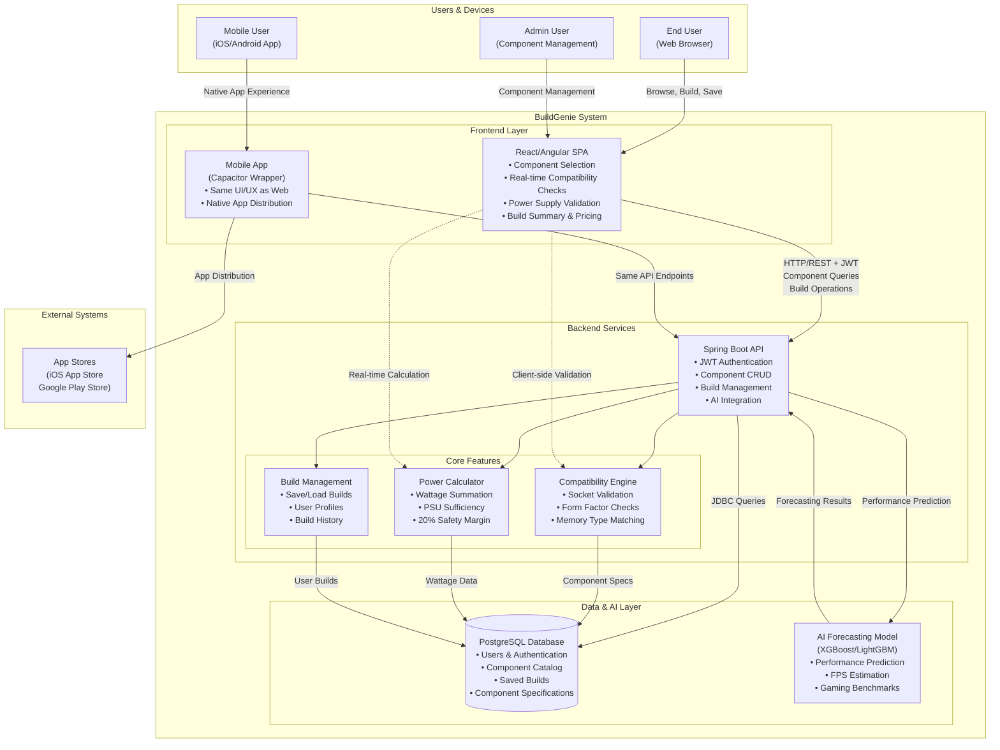

## Container Diagram
- Frontend: React SPA, routes guarded by `ProtectedRoute`, state in `AuthContext`, API via `services/api.js`.
- Backend: Controllers, Services, Repos, Security (`JwtAuthenticationFilter`, `SecurityConfig`), DTOs, Models.
- DB: `users`, `components`, `pc_builds` tables.

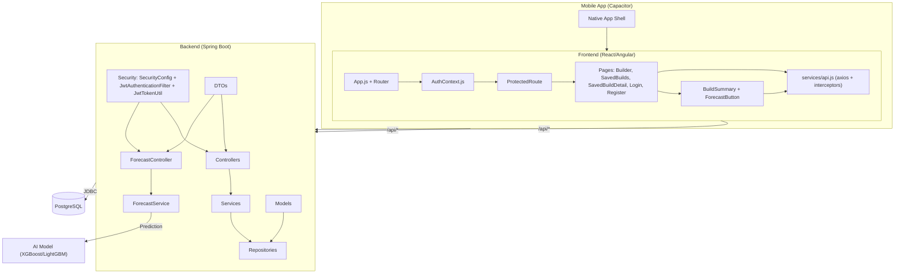

## Backend Components
- Controllers: `AuthController`, `ComponentController`, `PcBuildController`, `UserController`.
- Services: `AuthService`, `ComponentService`, `PCBuildService`, `UserService`.
- Repositories: `UserRepository`, `ComponentRepository`, `PcBuildRepository`.
- Security: `SecurityConfig`, `JwtAuthenticationFilter`, `JwtTokenUtil`.
- Config: `WebConfig` (CORS), `DataInitializer` (seed data).

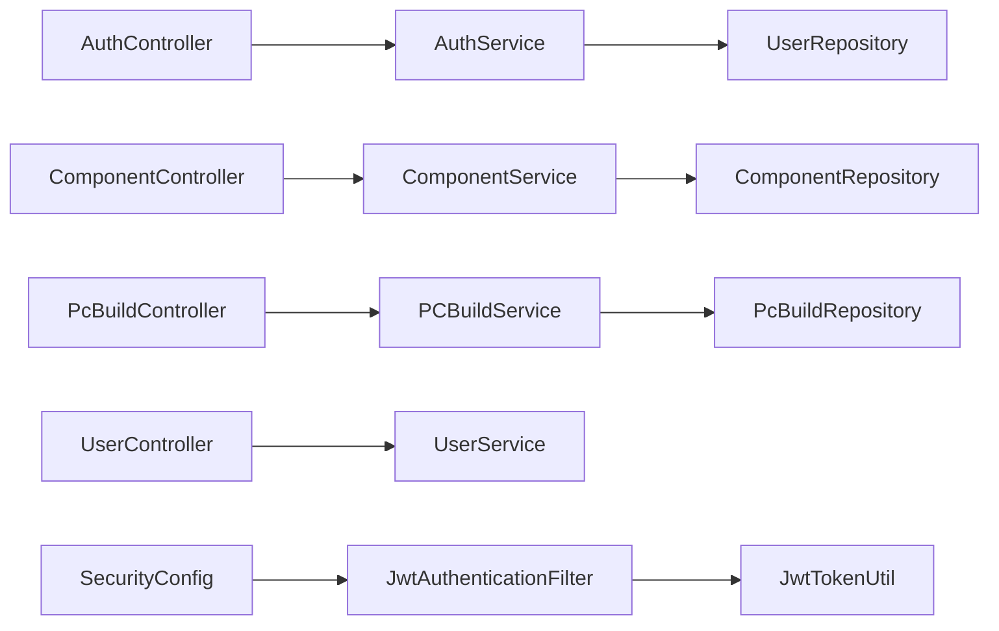

## Frontend Components
- Routing: `App.js` uses `ProtectedRoute` for authenticated pages.
- Auth: `AuthContext.js` persists token and user, sets axios default header.
- Services: `services/api.js` with axios instance and request interceptor (injects `Authorization: Bearer <token>`).
- UI: `Header`, `Footer`, shared UI (`button.jsx`, `card.jsx`, `input.jsx`).

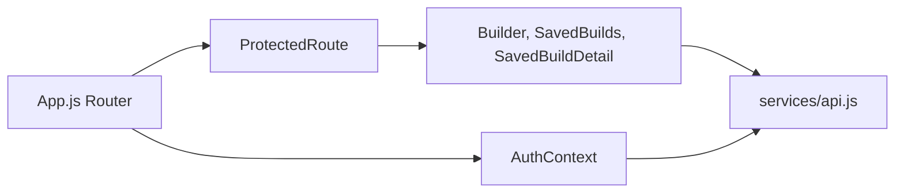

## UML Diagrams

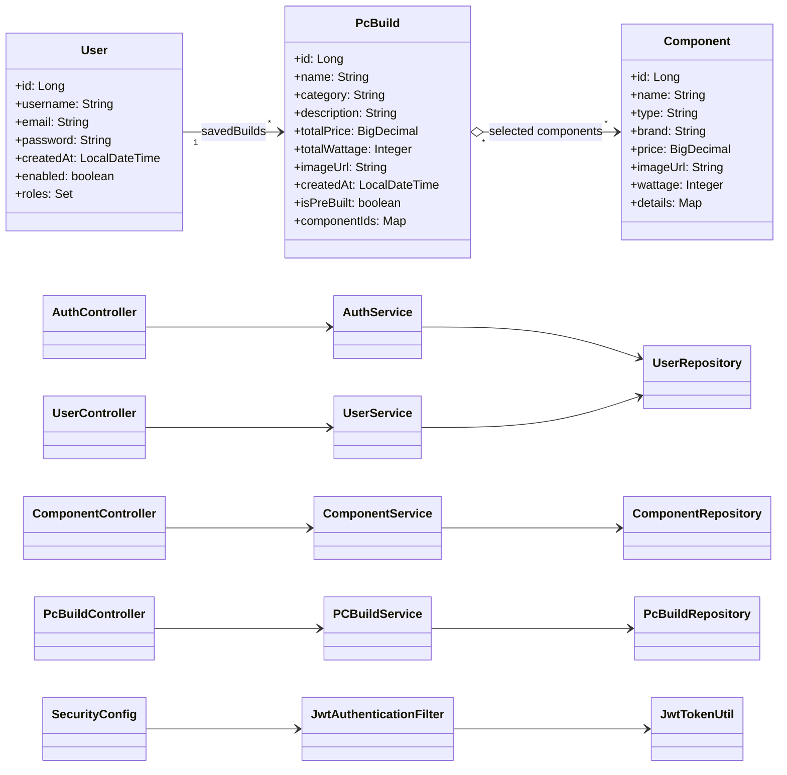

## DFD Diagrams

### DFD Level 0 (Context)
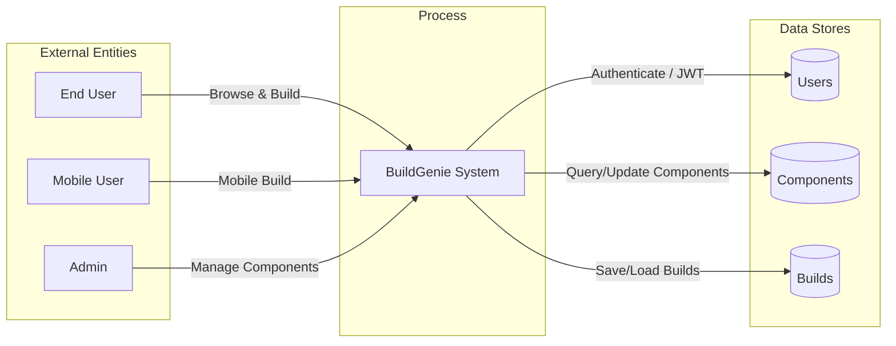

### DFD Level 1 (Build & Validation)
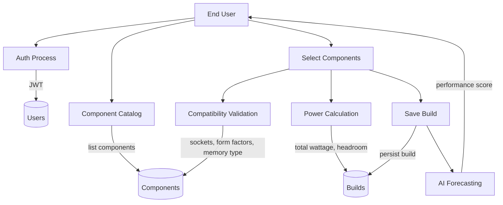

## Runtime Flows

### Login Flow
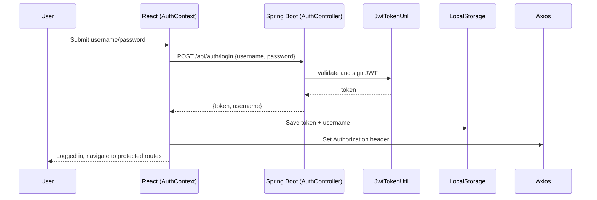

### Builder: Load Components & Save Build
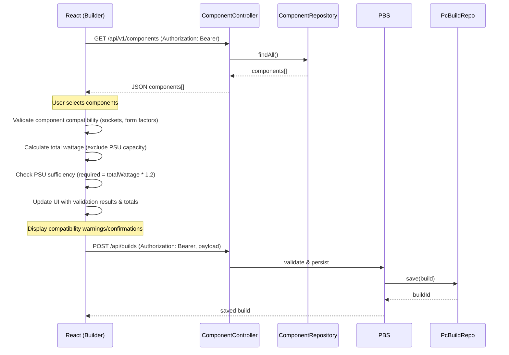

### AI Performance Forecasting Flow
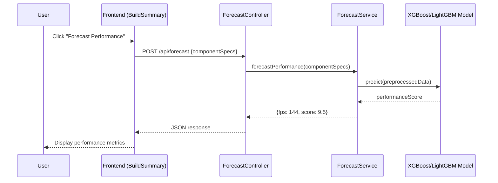

### Saved Builds: List & Detail
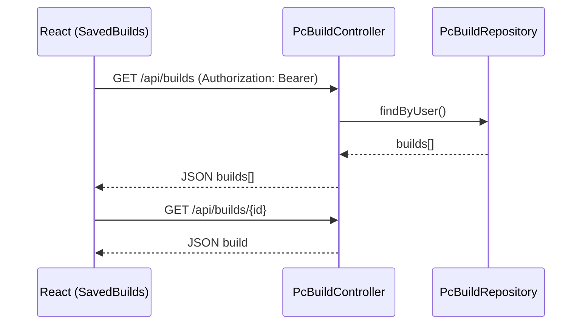

### Component Compatibility Checking Flow
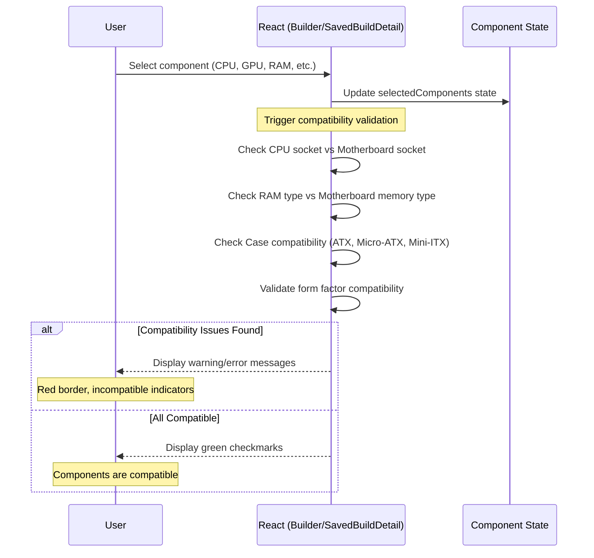

### Power Supply Validation Flow
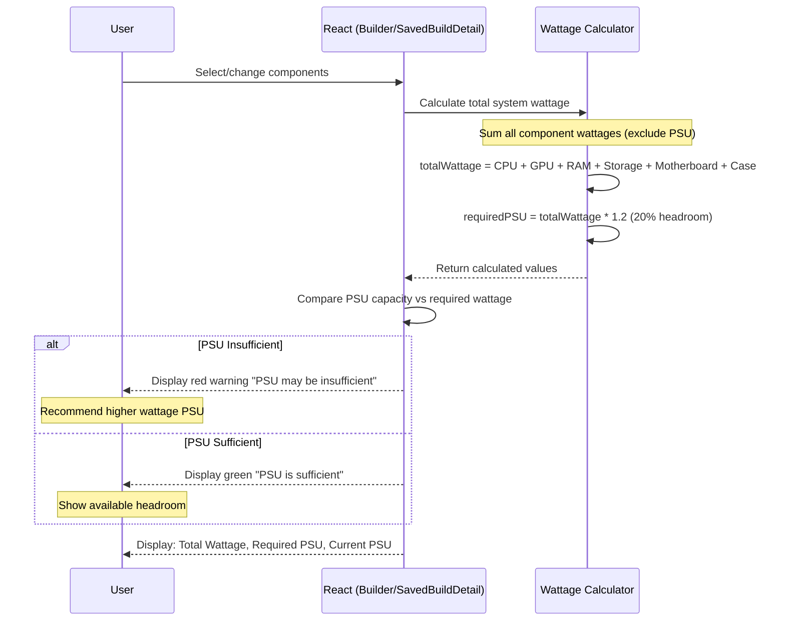
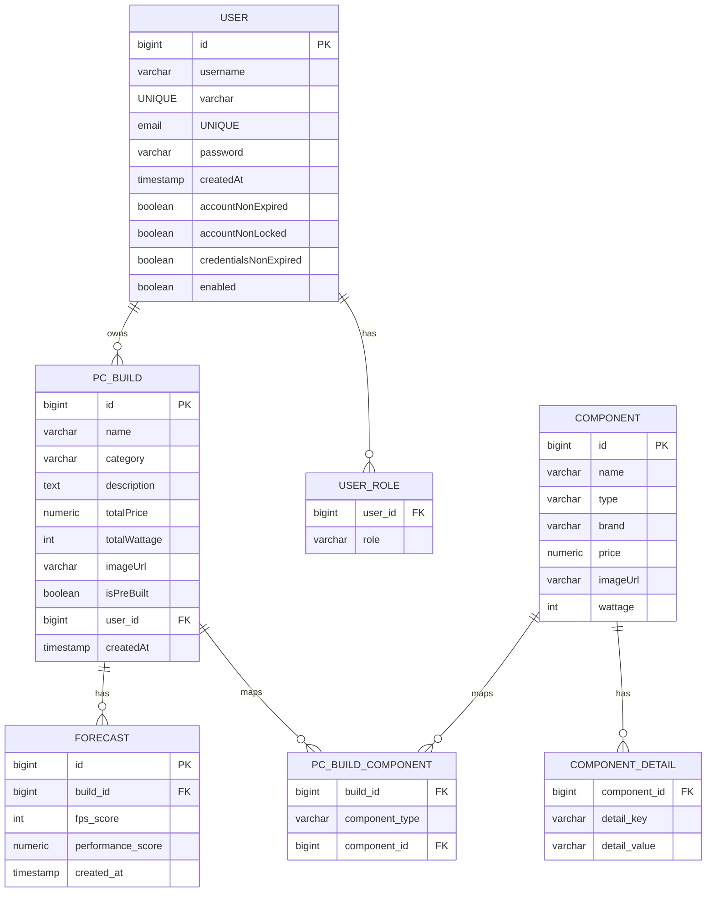

## Component Validation & Compatibility

BuildGenie includes comprehensive client-side validation for component compatibility and power supply adequacy to ensure users build functional PC configurations.

### Compatibility Rules
The frontend validates the following compatibility constraints:

1. **CPU & Motherboard Socket Compatibility**
   - CPU socket type must match motherboard socket (e.g., LGA1700, AM4, AM5)
   - Validated in real-time when either component is selected

2. **RAM & Motherboard Memory Type**
   - RAM type (DDR4, DDR5) must match motherboard memory support
   - Ensures memory modules are compatible with the motherboard

3. **Case & Motherboard Form Factor**
   - Case must support the motherboard form factor (ATX, Micro-ATX, Mini-ITX)
   - Prevents selection of cases too small for the chosen motherboard

4. **General Form Factor Validation**
   - Components must physically fit within the selected case
   - Validates against component dimensions and case specifications

### Power Supply Validation
The system calculates and validates power requirements:

1. **Wattage Calculation**
   - Sums wattage of all components except PSU (CPU + GPU + RAM + Storage + Motherboard + Case)
   - PSU wattage represents capacity, not consumption

2. **Headroom Calculation**
   - Required PSU capacity = Total system wattage × 1.2 (20% safety margin)
   - Ensures stable operation under peak loads

3. **Validation Logic**
   - Green indicator: PSU capacity ≥ required wattage
   - Red warning: PSU capacity < required wattage
   - Displays actual vs. required wattage for user reference

### Implementation Details
- **Location**: Frontend validation in `Builder.js` and `SavedBuildDetail.js`
- **Trigger**: Real-time validation on component selection/change
- **UI Feedback**: Color-coded indicators, warning messages, compatibility status
- **Data Source**: Component specifications stored in `specs` JSONB field

## Mobile App Wrapper

The BuildGenie application is also available as a mobile app through a web wrapper implementation using Capacitor.

### Mobile Architecture
- The mobile app is not a separate native implementation but a wrapper around the web application
- Capacitor provides native API access and app store distribution capabilities
- The same Angular/React frontend codebase is used for both web and mobile experiences

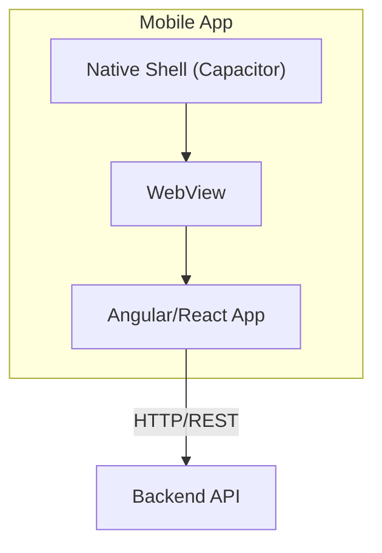

### Implementation Details
- **Technology**: Capacitor for wrapping the web application
- **Deployment**: Native app packages (.apk for Android, .ipa for iOS) distributed via app stores
- **UI/UX**: Responsive design ensures consistent experience across devices
- **Authentication**: Same JWT-based auth flow as the web application
- **API Access**: Uses the same API endpoints and services as the web application

## Security Architecture
- AuthN: JWT bearer tokens issued at `/api/auth/login`, stored in `localStorage`.
- AuthZ: `SecurityConfig` restricts protected endpoints; `JwtAuthenticationFilter` validates bearer token.
- Passwords: BCrypt hashing via `PasswordEncoder`.
- CORS: Configured in `WebConfig` to allow frontend origin; CSRF disabled for stateless API.
- Protected Endpoints:
  - `/api/v1/components` (GET/POST/PUT/DELETE) – authenticated
  - `/api/builds` (CRUD) – authenticated
  - `/api/forecast` (POST) – authenticated
  - `/api/auth/register`, `/api/auth/login` – public
## Environment & Deployment
- Local Dev:
  - Frontend: CRA dev server on `http://localhost:3000` with proxy to backend (`/api/*`).
  - Backend: Spring Boot on `http://localhost:8080`.
  - DB: PostgreSQL (connection via Spring Data JPA).
  - AI Model: Loaded from file at application startup.
- Configuration:
  - Axios interceptor ensures `Authorization` header on all requests.
  - Default boolean flags on `User` should be non-null and default `true`.
  - Mobile app uses the same backend endpoints.

## Observability & Error Handling
- Logging: Spring logging (controllers/services), browser console for frontend.
- Errors: Backend returns structured JSON errors; frontend displays UI messages on failures.
- Future: Add centralized exception handlers and request IDs for tracing.

## Notes & Next Steps
- Role-based access: Introduce roles (e.g., `ROLE_ADMIN`) to gate `ComponentInsert`.
- Validation: Add DTO validation annotations and frontend form validation.
- Monitoring: Add metrics and health checks (`/actuator`).
- CI/CD: Add pipeline to build frontend & backend, run tests, and deploy.